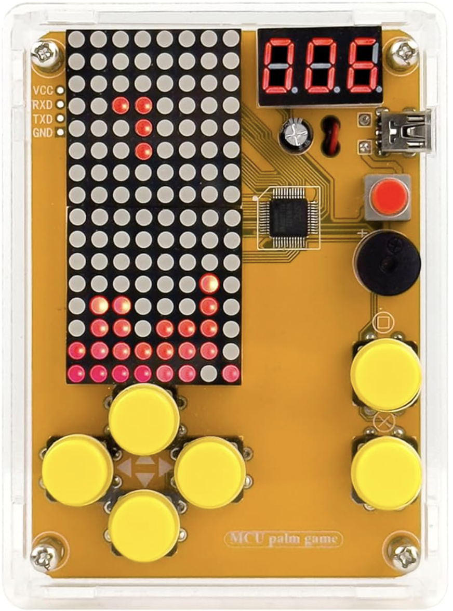
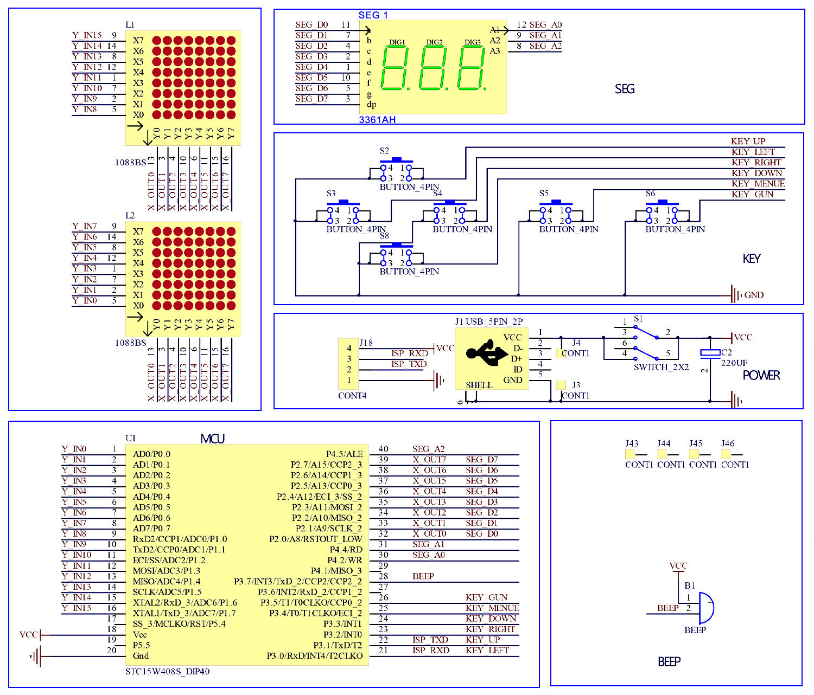

# Real Time Planetary Tracker
<!-- Replace this text with a brief description (2-3 sentences) of your project. This description should draw the reader in and make them interested in what you've built. You can include what the biggest challenges, takeaways, and triumphs from completing the project were. As you complete your portfolio, remember your audience is less familiar than you are with all that your project entails! -->
My project is the real time planet tracker, which uses a laser connected to a servo system to point to the planet of my choice. To build this project, I had to assemble a complicated wiring and hardware set, but the hardest part by far of this project was the software. Because the motion of objects in space is far from simple, I had to use comprehensive astronomical data and combine that with many mathematical calculations to produce an accurate result.

| **Engineer** | **School** | **Area of Interest** | **Grade** |
|:--:|:--:|:--:|:--:|
| Olin X | The College Preparatory School | Aerospace Engineering | Incoming Junior


  
# Additional Modifications

<iframe width="560" height="315" src="https://www.youtube.com/embed/rmb-5CQay6I?si=cS7Bu7h3ZsFfuypu" title="YouTube video player" frameborder="0" allow="accelerometer; autoplay; clipboard-write; encrypted-media; gyroscope; picture-in-picture; web-share" referrerpolicy="strict-origin-when-cross-origin" allowfullscreen></iframe>

After finishing my third milestone, I continued to make additions to improve my project. After having the laser on for a very long time while testing my code, its power has decreased over time. I replaced it with a new one, and to prevent the issue of it dimming due to overuse, I added a switch so I can turn it off and on when I want to. The laser works independently of the servos, so even if the laser is off, the servos are unaffected. Additionally, I hot glued a compass to my box, and I have a separate arrow on a piece of tape. Instead of relying on an IMU to read compass heading and pass it off to the Arduino to use in its calculations, all I have to do is make sure that the red arrow pointing north on the compass points in the same direction as the other arrow.

# Final Milestone

<iframe width="560" height="315" src="https://www.youtube.com/embed/tGtN5k_BZUU?si=HG9aF8upFtzo1Yr8" title="YouTube video player" frameborder="0" allow="accelerometer; autoplay; clipboard-write; encrypted-media; gyroscope; picture-in-picture; web-share" referrerpolicy="strict-origin-when-cross-origin" allowfullscreen></iframe>

### Progress
For the third and final milestone, I implemented some of my desired modifications. I added tracking for more objects, which are the moon and the dwarf planets Ceres, Haumea, Makemake, and Eris. Additionally, I 3D printed a box for my project to fit into and screwed in all my parts to secure them to the box. I redid my wiring, improving the organization of the many wires to avoid tangling, and I replaced the breadboard with a much smaller cut perf board to reduce the space that it takes up. I hot glued my laser to my tilt servo, finally getting rid of the makeshift tape that I had used for so long. Lastly, I added a screen to my project to display the data that I get from the serial monitor. It makes extracting the information from the calculations simple and easy for people who don't understand the project as much as I do. The serial monitor was good for debugging my numbers, but its constant updating of information is hard to follow and strains the eyes. The screen was a logical step to complement the movement of the servos.

### Challenges
One of my modifications that I implemented for my third milestone was to add tracking capabilities for the dwarf planets Ceres, Haumea, Makemake, and Eris. At first, it seemed easy, since the same orbital element system that I used for the other planets theoretically should be compatible with these new additions. However, due to the lack of reliable orbital information for these dwarf planets, the results were terribly off. Additionally, most of the dwarf planets have highly elliptical and inclined orbits, which also worsen the accuracy of my tracker. My solution was to use a linear extrapolation technique. Using data from NASA, which is basically the only 100% reliable data source, I downloaded tables containing the right ascension and declination of each of the objects that I wanted for every three days during the next 10 years. Then, using the GPS module, I would calculate how far into the 3 day period I was, and could then give my exact time a specific right ascension and declination to use in my calculations. With this approach, my results drastically improved, their accuracy being comparable to that of the inner planets, which is highly commendable. Of course, linear extrapolation, as an approximation technique, will never be perfect, requiring higher power algorithms to simulate the smoother flow of the rates of change of right ascension and declination, but the error was already pretty low. I could have made a shorter time interval to increase the accuracy even more, but I felt like my current combination of day spacing and time length was ideal to balance accuracy and storage requirements, and a shorter time interval would risk straining my storage space.

I also added tracking capabilities for the moon to my tracker as well. Because the moon orbits Earth instead of the sun, I came in with the expectation that the moon needed separate calculations, as opposed to the dwarf planets. With a few equations to calculate the moon's position, my results were pretty accurate. However, the error that I encountered was slightly higher than I felt was acceptable, so in the future, I will see if adding more terms to my moon equations would solve the issue.

I faced another challenge when I used Onshape to construct a box for my project to fit in. I never used any CAD software before, so getting used to the swing of things required a lot of learning. Eventually I got used to the sketch and extrude process to form shapes, but I never thought about how much measurement was needed and how many things you have to think about and check for when designing. For example, I forgot to add many holes for various parts to fit into. However, my biggest mistake that I made when making my rough draft was not adding tolerance to my design. Tolerance is the extra space that you add when you assemble. Since there was little to no tolerance, my parts would rarely fit into their holes. I was too focused on getting the most snug fit when I should have realized that getting a snug fit wasn't really necessary in the first place and that the 3D printer would naturally create some deviations in size that could make the printed dimensions different than what I initially intended. To make sure that my next draft addressed the aforementioned issues, I started cutting and marking my old draft to see what improvements were necessary. My second and final draft turned out much better, and I was able to place everything in the box. It wasn't perfect, as the potentiometer is a tad close to the servos, and the screen was being getting into the way of the potentiometer. However, I made an improvisation, hot gluing the screen at a tilted angle, thus resolving the impediment issue. 

After removing my IMU (inertial measurement unit) for my second milestone since its compass readings were inaccurate, I wanted to see if I could get my IMU to properly function. I found out that IMUs typically do not work without prior calibration, so I made a separate Python file to calculate the hard iron (caused by magnetized objects near the IMU) and soft iron (caused by magnetizable objects near the IMU) offsets. The IMU would then take these inputted offsets into account to accurately calculate compass heading. However, after numerous failed attempts, my accuracy was not noticeably improving, so I had to stop trying to make it work and pivot to other things. My tracker could still function without the IMU, and I had to extensively verify that the calculation code was properly functioning and use CAD to build my box. If I had more time, I would return to the IMU and try to get it to work.

<!-- For your final milestone, explain the outcome of your project. Key details to include are:
- What you've accomplished since your previous milestone
- What your biggest challenges and triumphs were at BSE
- A summary of key topics you learned about
- What you hope to learn in the future after everything you've learned at BSE -->


# Second Milestone

<iframe width="560" height="315" src="https://www.youtube.com/embed/sy0oKP475To?si=CrjRI9YCKGZvWPwY" title="YouTube video player" frameborder="0" allow="accelerometer; autoplay; clipboard-write; encrypted-media; gyroscope; picture-in-picture; web-share" referrerpolicy="strict-origin-when-cross-origin" allowfullscreen></iframe>

### Progress
For the second milestone, I worked on the code which will make my servos move to the correct positions. However, I made an important hardware upgrade, which is that I replaced my servo system with a completely new one. The problem with the old setup was that the old servos could only rotate 180°, which is fine for the tilt servo, but insufficient for the pan servo, which needs to turn 360°. Hence, I obtained a servo which can turn almost 8 times over. Its capabilities are 

### Challenges
For the second milestone, I faced many different challenges, one of which was my 

<!-- For your second milestone, explain what you've worked on since your previous milestone. You can highlight:
- Technical details of what you've accomplished and how they contribute to the final goal
- What has been surprising about the project so far
- Previous challenges you faced that you overcame
- What needs to be completed before your final milestone -->

# First Milestone

<iframe width="560" height="315" src="https://www.youtube.com/embed/phVcLO6DWw8?si=puXWAZY8hmOiKYs6" title="YouTube video player" frameborder="0" allow="accelerometer; autoplay; clipboard-write; encrypted-media; gyroscope; picture-in-picture; web-share" referrerpolicy="strict-origin-when-cross-origin" allowfullscreen></iframe>

### Summary
My project, the real time planet tracker, will be able to track all the planets in the solar system and show me where they are in the sky. There are many components that have to work together to make my project work. Here is a quick summary:
Arduino board: stores all the code and communicates with all the other parts
Servos: a set of two which point at the direction that the Arduino board tells them to go to
GPS Module: records the time and location for the Arduino board to incorporate in its calculations
Breadboard: connects the wires together
IMU (Inertial Measurement Unit): Records orientation and sends that information to the Arduino so that the servos 
Potentiometer: Can be adjusted to switch between what planet is being tracked or track a planet's future and past location
Button: Toggles between the two modes of my planet tracker, tracking mode and trajectory mode
Laser: Connects to the servos so that when they move, it does too

### Progress
For my first milestone, I focused on building the wiring so that all the hardware is connected. I also made sure that they worked by connecting the Arduino board to my computer and seeing that the lights of the parts that had them were on.

### Challenges
The main problem that I faced was learning how to connect the pins together. Each component needed multiple connections to various other parts. I learned about where they needed to go and why. For example, in order for the GPS to communicate with my Arduino board, information must flow both ways. Therefore, the transmitter port of one must be connected to the receiving port of the other, and vice versa.

### Next Steps
With the wiring finished, I can move on to the software for my project, which will use mathematical calculations and astronomical data to determine where in the celestial sphere are the planets. Then, the servos will move to the appropriate location.

For your first milestone, describe what your project is and how you plan to build it. You can include:
- An explanation about the different components of your project and how they will all integrate together
- Technical progress you've made so far
- Challenges you're facing and solving in your future milestones
- What your plan is to complete your project


# Schematics 
Here's where you'll put images of your schematics. [Tinkercad](https://www.tinkercad.com/blog/official-guide-to-tinkercad-circuits) and [Fritzing](https://fritzing.org/learning/) are both great resoruces to create professional schematic diagrams, though BSE recommends Tinkercad becuase it can be done easily and for free in the browser. 

# Code
Here's where you'll put your code. The syntax below places it into a block of code. Follow the guide [here]([url](https://www.markdownguide.org/extended-syntax/)) to learn how to customize it to your project needs. 

```c++
#include <TinyGPSPlus.h>
#include <Wire.h>
#include <Adafruit_PWMServoDriver.h>
#include <TimeLib.h> // Required for Unix time conversion
#include <Adafruit_SSD1306.h>
#include <Adafruit_GFX.h>
#include <avr/pgmspace.h>
#include "ceres_data.h"
#include "haumea_data.h"
#include "makemake_data.h"
#include "eris_data.h"

#define PI 3.14159265358979323846
#define TWO_PI (2.0 * PI)
#ifndef degrees
double degrees(double rad) {
return rad * 180.0 / PI;
}
#endif

Adafruit_PWMServoDriver pwm = Adafruit_PWMServoDriver();
TinyGPSPlus gps;

#define SCREEN_WIDTH 128
#define SCREEN_HEIGHT 64
#define OLED_RESET -1  // or 4 if your screen uses that
Adafruit_SSD1306 display(SCREEN_WIDTH, SCREEN_HEIGHT, &Wire, OLED_RESET);

int pressed = 0;
int planet = 4;
int mode = 1;

#define PAN_CHANNEL 0
#define TILT_CHANNEL 1
#define PAN_MIN_PULSE 1008
#define PAN_MAX_PULSE 1242
#define TILT_MIN_PULSE 500
#define TILT_MAX_PULSE 2500

static const uint32_t GPSBaud = 9600;

double array[3];
int gpsYear, gpsMonth, gpsDay, gpsHour, gpsMinute;
double lat = 37.3387;
double lng = -121.8853;
double headingOffset = 0.0;
double lastAzimuth = 0.0;
double lastServoAz = 0.0;
double timeOffsetHours = 0.0;
double tiltAngle = 0.0;
double trueAzimuth = 0.0;
double trueAltitude = 0.0;
int projectedHour = 0;
int projectedMinute = 0;

tmElements_t tm;

unsigned long getUnixTime(int y, int mo, int d, int h, int mi, int s = 0) {
tm.Year = y - 1970;
tm.Month = mo;
tm.Day = d;
tm.Hour = h;
tm.Minute = mi;
tm.Second = s;
return makeTime(tm);
}

String getPlanetName(int num) {
switch (num) {
 case 1: return "Mercury";
 case 2: return "Venus";
 case 3: return "Earth";    // Keep Earth for calculations only
 case 4: return "Mars";
 case 5: return "Jupiter";
 case 6: return "Saturn";
 case 7: return "Uranus";
 case 8: return "Neptune";
 case 9: return "Pluto";
 case 10: return "Moon";
 case 11: return "Ceres";
 case 12: return "Haumea";
 case 13: return "Makemake";
 case 14: return "Eris";
 default: return "None";
}
}

int planetInput(int potval) {
if (potval <= 78) return 1;      // Mercury
else if (potval <= 156) return 2;  // Venus
else if (potval <= 234) return 4;  // Mars (skip Earth = 3)
else if (potval <= 313) return 5;  // Jupiter
else if (potval <= 392) return 6;  // Saturn
else if (potval <= 471) return 7;  // Uranus
else if (potval <= 550) return 8;  // Neptune
else if (potval <= 629) return 9;  // Pluto
else if (potval <= 708) return 10; // Moon
else if (potval <= 787) return 11; // Ceres
else if (potval <= 866) return 12; // Haumea
else if (potval <= 945) return 13; // Makemake
else return 14;                    // Eris
}

// The ephemeris tables all start at 2025‑Jan‑01 00:00 UTC
unsigned long dwarf_start_unix;
const float    dwarf_step_days = 3.0;

void setup() {
Serial.begin(9600);
Serial2.begin(GPSBaud);
Wire.begin();
pwm.begin();
pwm.setPWMFreq(50);
pinMode(13, OUTPUT);
pinMode(46, INPUT_PULLUP);
if (!display.begin(SSD1306_SWITCHCAPVCC, 0x3C)) { // Most OLEDs use 0x3C
Serial.println(F("SSD1306 allocation failed"));
for (;;); // Stop here if OLED fails
}
display.clearDisplay();
display.setTextSize(1);
display.setTextColor(SSD1306_WHITE);

dwarf_start_unix = getUnixTime(2025, 1, 1, 0, 0);

}

void loop() {
if (gps.location.isValid()) {
lat = gps.location.lat();
lng = gps.location.lng();
}

gpsYear = gps.date.year();
gpsMonth = gps.date.month();
gpsDay = gps.date.day();
gpsHour = gps.time.hour();
gpsMinute = gps.time.minute();

if (digitalRead(46) == HIGH) pressed = 0;
if (digitalRead(46) == LOW && pressed == 0) {
mode = !mode;
pressed = 1;
Serial.println("**Mode changed**");
delay(200);
}

if (mode == 1) {
int potval = analogRead(A14);
planet = planetInput(potval);
} else if (mode == 0) {
int potval = analogRead(A14);
int step = map(potval, 0, 1023, 0, 576);
int centeredStep = step - 288;
timeOffsetHours = centeredStep * 5.0 / 60.0;
double projectedHourTotal = gpsHour + gpsMinute / 60.0 + timeOffsetHours;
int totalMinutes = int(projectedHourTotal * 60);
int projectedDay = gpsDay + totalMinutes / (24 * 60);
projectedHour = (totalMinutes / 60) % 24;
projectedMinute = totalMinutes % 60;
if (projectedMinute < 0) {
  projectedMinute += 60;
  projectedHour -= 1;
}
if (projectedHour < 0) {
  projectedHour += 24;
  projectedDay -= 1;
}
}

if (mode == 0) {
Serial.println("== Trajectory Mode Info ==");
Serial.print("Time Offset (hours): ");
Serial.println(timeOffsetHours, 2);

Serial.print("Projected Time (UTC): ");
Serial.print(projectedHour < 10 ? "0" : ""); Serial.print(projectedHour);
Serial.print(":");
Serial.print(projectedMinute < 10 ? "0" : ""); Serial.println(projectedMinute);

// Reconstruct normalized date from Unix time
time_t projectedTime = getUnixTime(gpsYear, gpsMonth, gpsDay, gpsHour, gpsMinute) + long(timeOffsetHours * 3600.0);
tmElements_t projectedTm;
breakTime(projectedTime, projectedTm);

Serial.print("Projected Date (UTC): ");
Serial.print(projectedTm.Month < 10 ? "0" : ""); Serial.print(projectedTm.Month);
Serial.print("/");
Serial.print(projectedTm.Day < 10 ? "0" : ""); Serial.print(projectedTm.Day);
Serial.print("/");
Serial.println(projectedTm.Year + 1970);
}

int useHour = (mode == 0) ? projectedHour : gpsHour;
int useMinute = (mode == 0) ? projectedMinute : gpsMinute;
int useDay = gpsDay + ((mode == 0) ? (int)((gpsHour + gpsMinute / 60.0 + timeOffsetHours) / 24) : 0);
int useSecond = gps.time.second();
unsigned long unixTime = getUnixTime(gpsYear, gpsMonth, useDay, useHour, useMinute, useSecond);

double d = (unixTime - 946728000.0) / 86400.0; // days since J2000.0
double GMST = fmod(280.46061837 + 360.98564736629 * d, 360.0);
double LST = fmod(GMST + lng + 360.0, 360.0);

Serial.print("Unix Time: "); Serial.println(unixTime);
Serial.print("Days since J2000.0: "); Serial.println(d);
Serial.print("GMST: "); Serial.println(GMST);
Serial.print("LST: "); Serial.println(LST);

calculate(array, mode == 0 ? timeOffsetHours : 0.0, radians(LST), gps.time.second());

String name = getPlanetName(planet);
Serial.print("Planet Selected: "); Serial.print(name);
Serial.print(", #"); Serial.println(planet);

Serial.print("Latitude: "); Serial.println(lat, 4);
Serial.print("Longitude: "); Serial.println(lng, 4);

char dateStr[32];
sprintf(dateStr, "%02d/%02d/%04d", gpsMonth, gpsDay, gpsYear);
Serial.print("Date(UTC): "); Serial.println(dateStr);

char timeStr[32];
sprintf(timeStr, "%02d:%02d:%02d", gpsHour, gpsMinute, gps.time.second());
Serial.print("Time(UTC): "); Serial.println(timeStr);

Serial.print("Distance: "); Serial.print(array[2], 4); Serial.println(" AU");
Serial.print("RA: "); Serial.println(array[0], 4);
Serial.print("Dec: "); Serial.println(array[1], 4);
Serial.print("Pan Angle: "); Serial.print(lastServoAz, 2); Serial.println("°");
Serial.print("Tilt Angle: "); Serial.print(tiltAngle, 2); Serial.println("°");

trueAzimuth = lastServoAz;
trueAltitude = tiltAngle;

Serial.print("Azimuth (servo-based): "); Serial.print(lastAzimuth, 2); Serial.println("°");
Serial.print("Altitude (servo-based): "); Serial.print(trueAltitude, 2); Serial.println("°");

smartDelay(1000);

display.clearDisplay();

display.setCursor(0, 0);
display.print(getPlanetName(planet));
display.print(" ");
if (gps.time.isValid()) {
if (gpsHour < 10) display.print("0");
display.print(gpsHour);
display.print(":");
if (gpsMinute < 10) display.print("0");
display.print(gpsMinute);
display.print(":");
if (gps.time.second() < 10) display.print("0");
display.print(gps.time.second());
}

int16_t x1, y1;
uint16_t w, h;
display.getTextBounds("LIVE", 0, 0, &x1, &y1, &w, &h);
display.setCursor(SCREEN_WIDTH - w - 1, SCREEN_HEIGHT - h);  // Bottom-right corner
display.print(mode == 0 ? "TRJ" : "LIVE");

int y = 8;

if (mode == 0) {
display.setCursor(0, y); y += 8;
display.print("Offset: ");
display.print(timeOffsetHours, 2);
display.print("h");

display.setCursor(0, y); y += 8;
display.print("New: ");
if (projectedHour < 10) display.print("0");
display.print(projectedHour);
display.print(":");
if (projectedMinute < 10) display.print("0");
display.print(projectedMinute);
display.print(":");
if (gps.time.second() < 10) display.print("0");
display.print(gps.time.second());
}

display.setCursor(0, y); y += 8;
display.print("Dist:");
display.print(array[2], 4);  // show 4 decimal places
display.print("AU");

display.setCursor(0, y); y += 8;
display.print("RA: ");
display.print(array[0], 2); display.print("h");

display.setCursor(0, y); y += 8;
display.print("Dec:");
display.print(array[1], 2); display.write(248);  // degree symbol

display.setCursor(0, y); y += 8;
display.print("Az: ");
display.print(lastAzimuth, 1); display.write(248);

display.setCursor(0, y); y += 8;
display.print("Alt:");
display.print(trueAltitude, 1); display.write(248);

display.display();
}

static void smartDelay(unsigned long ms) {
unsigned long start = millis();
do {
while (Serial2.available()) gps.encode(Serial2.read());
} while (millis() - start < ms);
}

void calculate(double *array, double futureOffsetHours, double LST, int seconds) {
// Compute total hour offset including seconds
double hourTotal = gpsHour + gpsMinute / 60.0 + seconds / 3600.0 + futureOffsetHours;

// Handle wrap-around for negative/overflow hours
int addedDays = int(hourTotal / 24);
hourTotal = fmod(hourTotal, 24.0);
if (hourTotal < 0) {
  hourTotal += 24.0;
  addedDays--;
}

// Convert hourTotal into rounded hour/minute/second
int adjHour = int(hourTotal);
double minuteFraction = (hourTotal - adjHour) * 60.0;
int adjMinute = int(minuteFraction);
int adjSecond = int(round((minuteFraction - adjMinute) * 60.0));

if (adjSecond >= 60) {
  adjSecond -= 60;
  adjMinute += 1;
}
if (adjMinute >= 60) {
  adjMinute -= 60;
  adjHour += 1;
}
if (adjHour >= 24) {
  adjHour -= 24;
  addedDays++;
}

// Get Unix time for adjusted date/time
unsigned long unixTime = getUnixTime(gpsYear, gpsMonth, gpsDay + addedDays, adjHour, adjMinute, adjSecond);

// Days since J2000.0
double d = (unixTime - 946728000UL) / 86400.0;

// TT correction
double TT = d + (69.0 / 86400.0);
double T = TT / 36525.0;

// Moon
if (planet == 10) {
 double D = radians(fmod(297.8501921 + 445267.1114034 * T
   - 0.0018819 * T * T + T * T * T / 545868 - T * T * T * T / 113065000, 360.0));
 double M_sun = radians(fmod(357.5291092 + 35999.0502909 * T
   - 0.0001536 * T * T + T * T * T / 24490000, 360.0));
 double M_moon = radians(fmod(134.9633964 + 477198.8675055 * T
   + 0.0087414 * T * T + T * T * T / 69699 - T * T * T * T / 14712000, 360.0));
 double F = radians(fmod(93.2720950 + 483202.0175233 * T
   - 0.0036539 * T * T - T * T * T / 3526000 + T * T * T * T / 863310000, 360.0));

 double lon = 218.3164591
   + 481267.88134236 * T
   + 6.289 * sin(M_moon)
   - 1.274 * sin(2*D - M_moon)
   + 0.658 * sin(2*D)
   - 0.214 * sin(2*M_moon)
   - 0.11 * sin(D);
 lon = fmod(lon, 360.0);

 double lat_moon = 5.128 * sin(F)
   + 0.28 * sin(M_moon + F)
   - 0.28 * sin(F - M_moon)
   - 0.17 * sin(F - 2*D);

 double dist = 60.36298
   - 3.27746 * cos(M_moon)
   - 0.57994 * cos(2*D - M_moon)
   - 0.46357 * cos(2*D)
   + 0.08904 * cos(2*M_moon);

 double dist_au = dist * 0.000042635;

 double lon_rad = radians(lon);
 double lat_rad = radians(lat_moon);
 double x = dist_au * cos(lat_rad) * cos(lon_rad);
 double y = dist_au * cos(lat_rad) * sin(lon_rad);
 double z = dist_au * sin(lat_rad);

 double ec = radians(23.439292);
 double Xq = x;
 double Yq = y * cos(ec) - z * sin(ec);
 double Zq = y * sin(ec) + z * cos(ec);

 double alpha = atan2(Yq, Xq);
 if (alpha < 0) alpha += TWO_PI;
 double delta = atan2(Zq, sqrt(Xq*Xq + Yq*Yq));
 double distance = sqrt(Xq*Xq + Yq*Yq + Zq*Zq);

 array[0] = degrees(alpha) / 15.0;
 array[1] = degrees(delta);
 array[2] = distance;

 // ─── Horizontal Conversion ───
 double HA = fmod(LST - alpha + TWO_PI, TWO_PI);
 double x_hor = cos(HA) * cos(delta);
 double y_hor = sin(HA) * cos(delta);
 double z_hor = sin(delta);

 double xhor = x_hor * sin(radians(lat)) - z_hor * cos(radians(lat));
 double yhor = y_hor;
 double zhor = x_hor * cos(radians(lat)) + z_hor * sin(radians(lat));

 double az = atan2(yhor, xhor);
 az = degrees(az);
 az = fmod(az + 180.0, 360.0);  // Azimuth normalization
 double alt = -degrees(asin(zhor));

 float servoAz = fmod((az - headingOffset + 360.0), 360.0);
 float panPulse = PAN_MIN_PULSE + (servoAz / 360.0) * (PAN_MAX_PULSE - PAN_MIN_PULSE);
 panPulse = constrain(panPulse, PAN_MIN_PULSE, PAN_MAX_PULSE);

 float tiltPulse = TILT_MIN_PULSE + ((90.0 - alt) / 180.0) * (TILT_MAX_PULSE - TILT_MIN_PULSE);
 tiltPulse = constrain(tiltPulse, TILT_MIN_PULSE, TILT_MAX_PULSE);

 tiltAngle = ((tiltPulse - TILT_MIN_PULSE) / (TILT_MAX_PULSE - TILT_MIN_PULSE)) * 180.0 - 90.0;

 pwm.writeMicroseconds(PAN_CHANNEL, panPulse);
 pwm.writeMicroseconds(TILT_CHANNEL, tiltPulse);
 digitalWrite(13, HIGH);

 lastAzimuth = az;
 lastServoAz = servoAz;

 return;  // Done with Moon
}

// ────────────────────────────────────────────────────
// Dwarf planets via PROGMEM tables + linear interpolation
// ────────────────────────────────────────────────────
if (planet >= 11 && planet <= 14) {
  // 1) how many days have elapsed since the table start?
  double daysSinceStart = (double)(unixTime - dwarf_start_unix) / 86400.0;
  double rawIndex      = daysSinceStart / dwarf_step_days;
  int    i0            = constrain(int(floor(rawIndex)), 0, ceres_num_records - 2);
  int    i1            = i0 + 1;
  float  frac          = rawIndex - i0;

  // 2) pick the right table pointers
  const float *raTable, *decTable, *distTable;
  switch (planet) {
    case 11: raTable = ceres_ra_deg;   decTable = ceres_dec_deg;   distTable = ceres_dist_au;   break;
    case 12: raTable = haumea_ra_deg;  decTable = haumea_dec_deg;  distTable = haumea_dist_au;  break;
    case 13: raTable = makemake_ra_deg;decTable = makemake_dec_deg;distTable = makemake_dist_au;break;
    case 14: raTable = eris_ra_deg;    decTable = eris_dec_deg;    distTable = eris_dist_au;    break;
  }

  // 3) read & interpolate via pgm_read_float_near()
  float ra0  = pgm_read_float_near(&raTable[i0]);
  float ra1  = pgm_read_float_near(&raTable[i1]);
  float dec0 = pgm_read_float_near(&decTable[i0]);
  float dec1 = pgm_read_float_near(&decTable[i1]);
  float d0   = pgm_read_float_near(&distTable[i0]);
  float d1   = pgm_read_float_near(&distTable[i1]);

// --- DEBUG PRINTS: put them right here ---
  Serial.print("dwarf_start_unix: "); Serial.println(dwarf_start_unix);
  Serial.print("unixTime: "); Serial.println(unixTime);
  Serial.print("daysSinceStart: "); Serial.println(daysSinceStart, 3);
  Serial.print("rawIndex: "); Serial.println(rawIndex, 3);
  Serial.print("i0: "); Serial.println(i0);
  Serial.print("i1: "); Serial.println(i1);
  Serial.print("frac: "); Serial.println(frac, 3);
  Serial.print("dist d0: "); Serial.println(d0, 6);
  Serial.print("dist d1: "); Serial.println(d1, 6);
  // ----------------------------------------

  float ra_deg   = ra0   + frac * (ra1   - ra0);
  float dec_deg  = dec0  + frac * (dec1  - dec0);
  float dist_au  = d0    + frac * (d1    - d0);

  // 4) store into your array (RA in hours)
  array[0] = ra_deg / 15.0;
  array[1] = dec_deg;
  array[2] = dist_au;

  // convert back to radians for the horizontal section:
  double alpha = radians(ra_deg);
  double delta = radians(dec_deg);

// Compute horizontal coordinates
double HA = fmod(LST - alpha + TWO_PI,TWO_PI);
double x_hor = cos(HA)*cos(delta);
double y_hor = sin(HA)*cos(delta);
double z_hor = sin(delta);

double xhor = x_hor*sin(radians(lat)) - z_hor*cos(radians(lat));
double yhor = y_hor;
double zhor = x_hor*cos(radians(lat)) + z_hor*sin(radians(lat));

double az = atan2(yhor,xhor);
az=degrees(az);
az=fmod(az+180.0,360.0);
double alt = -degrees(asin(zhor));

float servoAz=fmod((az-headingOffset+360.0),360.0);
float panPulse=PAN_MIN_PULSE+(servoAz/360.0)*(PAN_MAX_PULSE-PAN_MIN_PULSE);
panPulse=constrain(panPulse,PAN_MIN_PULSE,PAN_MAX_PULSE);

float tiltPulse=TILT_MIN_PULSE+((90.0-alt)/180.0)*(TILT_MAX_PULSE-TILT_MIN_PULSE);
tiltPulse=constrain(tiltPulse,TILT_MIN_PULSE,TILT_MAX_PULSE);

tiltAngle=((tiltPulse-TILT_MIN_PULSE)/(TILT_MAX_PULSE-TILT_MIN_PULSE))*180.0-90.0;

pwm.writeMicroseconds(PAN_CHANNEL,panPulse);
pwm.writeMicroseconds(TILT_CHANNEL,tiltPulse);
digitalWrite(13,HIGH);

lastAzimuth=az;
lastServoAz=servoAz;
return;
}

// Classical planets
double a[] = {0,0.387098,0.723330,1.000000,1.523688,5.20260,9.55491,19.2184,30.1104,39.4821};
double e[] = {0,0.205630 + 0.000020406*T,0.006773 - 0.000049*T,0.016710 - 0.000042037*T,0.093312 + 0.000092064*T,0.048334 + 0.00016418*T,0.055892 - 0.000346818*T,0.046344 - 0.00002658*T,0.008997 + 0.00000633*T,0.24880766};
double i[] = {0,7.00487 - 23.51e-6*T,3.39471 - 2.86e-6*T,0.00005 - 46.94e-6*T,1.85061 - 25.47e-6*T,1.30530 - 4.15e-6*T,2.48446 + 6.11e-6*T,0.76986 - 2.09e-6*T,1.76917 - 3.64e-6*T,17.14175};
double Omega[] = {0,48.33167 - 446.30e-6*T,76.68069 - 996.89e-6*T,0.0,49.57854 - 1.105e-5*T,100.55615 + 1.019e-5*T,113.71504 - 1.143e-5*T,74.22988 - 1.578e-5*T,131.72169 - 1.151e-5*T,110.30347};
double Pi[] = {0,77.45645 + 573.57e-6*T,131.53298 - 108.80e-6*T,102.94719 + 1198.28e-6*T,336.04084 + 1590.20e-6*T,14.75385 + 870.53e-6*T,92.43194 + 541.14e-6*T,170.96424 + 408.52e-6*T,44.97135 + 292.73e-6*T,224.06676};
double L[] = {0,
  fmod(252.250906 + 149472.6746358*T,360.0),
  fmod(181.979801 + 58517.8156760*T,360.0),
  fmod(100.466457 + 35999.3728565*T,360.0),
  fmod(355.433000 + 19140.2993039*T,360.0),
  fmod(34.351519 + 3034.9056606*T,360.0),
  fmod(50.077444 + 1222.1138488*T,360.0),
  fmod(314.055005 + 428.4669983*T,360.0),
  fmod(304.348665 + 218.4862002*T,360.0),
  fmod(238.929038 + 145.2078052*T,360.0)
};

double M = radians(fmod(L[planet]-Pi[planet]+360.0,360.0));
double ecc = e[planet];
double v = M + (2*ecc -0.25*pow(ecc,3))*sin(M)
              + (1.25*pow(ecc,2))*sin(2*M)
              + ((13.0/12.0)*pow(ecc,3))*sin(3*M);
double r = a[planet]*(1 - ecc*ecc)/(1 + ecc*cos(v));
double i_rad = radians(i[planet]);
double o_rad = radians(Omega[planet]);
double w_rad = radians(Pi[planet]-Omega[planet]);
double v_plus_w = v + w_rad;

double x = r*(cos(o_rad)*cos(v_plus_w)-sin(o_rad)*sin(v_plus_w)*cos(i_rad));
double y = r*(sin(o_rad)*cos(v_plus_w)+cos(o_rad)*sin(v_plus_w)*cos(i_rad));
double z = r*sin(v_plus_w)*sin(i_rad);

// --- Compute Earth's heliocentric position ---
double ME = radians(fmod(L[3] - Pi[3] + 360.0, 360.0));
double eE = e[3];
double vE = ME + (2 * eE - 0.25 * pow(eE, 3)) * sin(ME)
               + (1.25 * pow(eE, 2)) * sin(2 * ME)
               + ((13.0 / 12.0) * pow(eE, 3)) * sin(3 * ME);
double rE = a[3] * (1 - eE * eE) / (1 + eE * cos(vE));

double iE = radians(i[3]);
double oE = radians(Omega[3]);
double wE = radians(Pi[3] - Omega[3]);
double vE_plus_w = vE + wE;

double xE = rE * (cos(oE) * cos(vE_plus_w) - sin(oE) * sin(vE_plus_w) * cos(iE));
double yE = rE * (sin(oE) * cos(vE_plus_w) + cos(oE) * sin(vE_plus_w) * cos(iE));
double zE = rE * sin(vE_plus_w) * sin(iE);

// Subtract Earth's position to get geocentric coordinates
double xg = x - xE;
double yg = y - yE;
double zg = z - zE;

 double ec = radians(23.439292);
 double Xq = xg;
 double Yq = yg * cos(ec) - zg * sin(ec);
 double Zq = yg * sin(ec) + zg * cos(ec);

double alpha = atan2(Yq,Xq);
if (alpha<0) alpha+=TWO_PI;
double delta = atan2(Zq,sqrt(Xq*Xq+Yq*Yq));
double distance = sqrt(Xq*Xq+Yq*Yq+Zq*Zq);

array[0]=degrees(alpha)/15.0;
array[1]=degrees(delta);
array[2]=distance;

horizontal:
// Horizontal computation (Moon and planets)
;

// Compute horizontal coordinates
double HA = fmod(LST - alpha + TWO_PI,TWO_PI);
double x_hor = cos(HA)*cos(delta);
double y_hor = sin(HA)*cos(delta);
double z_hor = sin(delta);

double xhor = x_hor*sin(radians(lat)) - z_hor*cos(radians(lat));
double yhor = y_hor;
double zhor = x_hor*cos(radians(lat)) + z_hor*sin(radians(lat));

double az = atan2(yhor,xhor);
az=degrees(az);
az=fmod(az+180.0,360.0);
double alt = -degrees(asin(zhor));

float servoAz=fmod((az-headingOffset+360.0),360.0);
float panPulse=PAN_MIN_PULSE+(servoAz/360.0)*(PAN_MAX_PULSE-PAN_MIN_PULSE);
panPulse=constrain(panPulse,PAN_MIN_PULSE,PAN_MAX_PULSE);

float tiltPulse=TILT_MIN_PULSE+((90.0-alt)/180.0)*(TILT_MAX_PULSE-TILT_MIN_PULSE);
tiltPulse=constrain(tiltPulse,TILT_MIN_PULSE,TILT_MAX_PULSE);

tiltAngle=((tiltPulse-TILT_MIN_PULSE)/(TILT_MAX_PULSE-TILT_MIN_PULSE))*180.0-90.0;

pwm.writeMicroseconds(PAN_CHANNEL,panPulse);
pwm.writeMicroseconds(TILT_CHANNEL,tiltPulse);
digitalWrite(13,HIGH);

lastAzimuth=az;
lastServoAz=servoAz;
}
```


# Bill of Materials
<!-- Here's where you'll list the parts in your project. To add more rows, just copy and paste the example rows below.
Don't forget to place the link of where to buy each component inside the quotation marks in the corresponding row after href =. Follow the guide [here]([url](https://www.markdownguide.org/extended-syntax/)) to learn how to customize this to your project needs. -->

| **Part** | **Note** | **Price** | **Link** |
|:--:|:--:|:--:|:--:|
| Elegoo MEGA R3 Board | Contains code, gathers information, calls actions | $22.99 | <a href="https://www.amazon.com/ELEGOO-ATmega2560-ATMEGA16U2-Arduino-Compliant/dp/B01H4ZDYCE/ref=sr_1_2_sspa?crid=1T53YUJ9OSSYN&dib=eyJ2IjoiMSJ9.r70JjFX8-805Ic29MiqGyIVrIwfR90S-MU_43sZp-KAAVlcNAEOr1T7rwwAVzsvcHYga9dGGK0BXwihyPfPnVkL-oHYhHvR4EqifUFiWe18iVrBPIxtgxLOfTWVFeFkJ_wYOAIF6morxGyUOCkb7Mv03nJ13hyW4g7lgQ0ED57YvOHz6QQxS7sDrnHCocjaue2R8aYYmtOcClzcG0fsbSfkAFyo61HtpQTykT-43P6o.34VkovS5jdwrKuRlvnvXA0BTvsBoZuyzxBxjrIDFRiM&dib_tag=se&keywords=elegoo%2Bcontroller%2Bboard&qid=1750204394&sprefix=elegoo%2Bcontroller%2Bboa%2Caps%2C138&sr=8-2-spons&sp_csd=d2lkZ2V0TmFtZT1zcF9hdGY&th=1"> Link </a> |
| 2 Micro Servos | Moves to point to a specific planet | $6.99 \(for 2) | <a href="https://www.amazon.com/Sipytoph-Helicopter-Airplane-Walking-Control/dp/B09185SC1W/ref=sr_1_8?crid=EG34UOQG1ZTB&keywords=micro+servo+sg90&qid=1689876515&sprefix=micro+servo+sg%2Caps%2C410&sr=8-8"> Link </a> |
| Hitec HS-785HB Winch Servo | Acts as the pan servo | $59.99 | <a href="https://www.amazon.com/Hitec-RCD-33785S-HS-785HB-Winch/dp/B000BOGI7E?th=1"> Link </a> |
| MG 996R Servo | Acts as the tilt servo | $15.29 \(for 4) | <a href="https://www.amazon.com/Hosyond-MG996R-Digital-Motors-Helicopter/dp/B0BYD9M1P3/ref=sxin_17_pa_sp_search_thematic_sspa?content-id=amzn1.sym.2da95b6c-f59a-4699-bc43-d0ff036c6388%3Aamzn1.sym.2da95b6c-f59a-4699-bc43-d0ff036c6388&crid=B9T9FE27E2NC&cv_ct_cx=MG996R&keywords=MG996R&pd_rd_i=B0BYD9M1P3&pd_rd_r=ba97bd06-de66-4cfa-83eb-2d6068a4b181&pd_rd_w=DndI0&pd_rd_wg=wYx67&pf_rd_p=2da95b6c-f59a-4699-bc43-d0ff036c6388&pf_rd_r=RMSQFHC8CSY07CZMG225&qid=1750722657&s=toys-and-games&sbo=RZvfv%2F%2FHxDF%2BO5021pAnSA%3D%3D&sprefix=mg996r%2Ctoys-and-games%2C121&sr=1-1-6024b2a3-78e4-4fed-8fed-e1613be3bcce-spons&sp_csd=d2lkZ2V0TmFtZT1zcF9zZWFyY2hfdGhlbWF0aWM&th=1"> Link </a> |
| Laser Diode | Points to planets | $6.79 \(for 10) | <a href="https://www.amazon.com/Arduino-A000066-ARDUINO-UNO-R3/dp/B008GRTSV6/"> Link </a> |
| GT-U7 GPS Module | Provides the location and time | $18.99 | <a href="https://www.amazon.com/Navigation-Positioning-Sensitivity-Consumption-High-Precision/dp/B08MZ2CBP7/ref=sr_1_3?crid=EUNF72IZZWV6&keywords=gt-u7&qid=1689876233&sprefix=gt-u%2Caps%2C606&sr=8-3"> Link </a> |
| Button | Switches between tracking and trajectory mode | $7.28 \(for 10) | <a href="https://www.amazon.com/uxcell-12x12x8mm-Momentary-Tactile-Button/dp/B07HBQFJ1W/ref=sr_1_7?crid=1X7TFPYURXRHV&dib=eyJ2IjoiMSJ9.PNWLG9o609D8oXdYBHsXFgiEOX3LBWKI2iaA5tyUEKX6A0hHrN2Cq6vAlKID-tXq0ie7hX5vajAYawyS2zZ3g56sQxCXnmWqhua9CwuO_SsjcVxJ4FijQ_T5HL3sncOQ01bL0RTFXPetZ9qX0-q5osuXo6BhPkf8fsxAwixwJQuksZd4RZGiiKnGeIE4PviZPN4_g7gH-CIv8qPsoJaY1wsbmIkiECSeLbcPZfecMpo.rh6p9w2fgW4PMCpEeECCD0L26VFsT8UVY2e1_xZzvUk&dib_tag=se&keywords=adafruit+tactile+button+12+x+8&qid=1752534816&sprefix=adafruit+tactile+buttom+12+x+8%2Caps%2C142&sr=8-7"> Link </a> |
| SparkFun 9DoF IMU | Detects compass orientation and adjusts the servos accordingly | $19.95 | <a href="https://www.amazon.com/SparkFun-Breakout-ICM-20948-connection-Accelerometer-Magnetometer/dp/B07VNV3WKL/ref=sr_1_1?crid=1LGYJ3JV9LD70&dib=eyJ2IjoiMSJ9.34764cQ6p-jmLkr3GhwuUft2p42-bwaCQWvtW6GQKp0PtXP2jO3QcJjJjhMM_Wgxb3FDngdMkItrhQREMDplIzq8zrsY7p6J7c_TNlW4_zJIH3diYQoDOrdX146CmsYYGPJw352zWbWPPhyTuUuMXil8arsazfTfrbRdjwiAyXn0g3rrfPkfHIG8hB0u39PpkniX-LKQ6Jbo-USjqMWSBiGwTzGhiWaBGIg6nYvF5Vd9MFDr9UgW0stDiTzraU6z.P1sUR-HRp05hkjn9ld2r5K4xRAj7EfXCN2LaUlHcKQA&dib_tag=se&keywords=sparkfun+imu&qid=1750692938&s=industrial&sprefix=sparkfun+i%2Cindustrial%2C324&sr=1-1"> Link </a> |

# Starter Project

<iframe width="560" height="315" src="https://www.youtube.com/embed/RcaV0-HjO3g?si=7L-r6T0KN0yvXpgU" title="YouTube video player" frameborder="0" allow="accelerometer; autoplay; clipboard-write; encrypted-media; gyroscope; picture-in-picture; web-share" referrerpolicy="strict-origin-when-cross-origin" allowfullscreen></iframe>



### Components

Some challenges that I faced were the wires and the soldering. The wires had to be cut to a certain length, not too long to dangle everywhere, but not too short as to strain the hit of the console's frame. I made sure to measure and test multiple times before I cut the wires. Additionally, many of the soldering components were very near each other. Therefore, I had to adjust my angle of approach in order to get a good-quality solder without creating a short circuit by connecting two adjacent joints. Next, I will begin my intensive project, which will be the real time planetary tracker.

### Schematic


<!--
# Other Resources/Examples
One of the best parts about Github is that you can view how other people set up their own work. Here are some past BSE portfolios that are awesome examples. You can view how they set up their portfolio, and you can view their index.md files to understand how they implemented different portfolio components.
- [Example 1](https://trashytuber.github.io/YimingJiaBlueStamp/)
- [Example 2](https://sviatil0.github.io/Sviatoslav_BSE/)
- [Example 3](https://arneshkumar.github.io/arneshbluestamp/)

To watch the BSE tutorial on how to create a portfolio, click here.
-->
